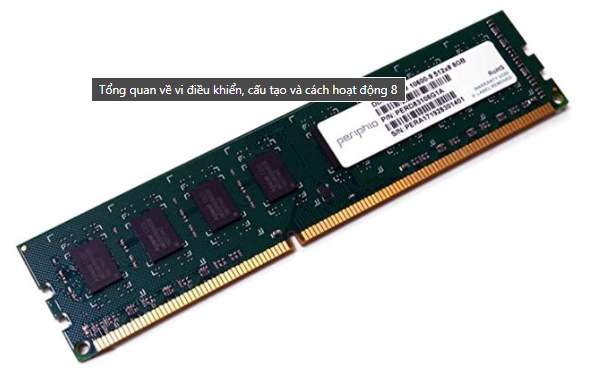
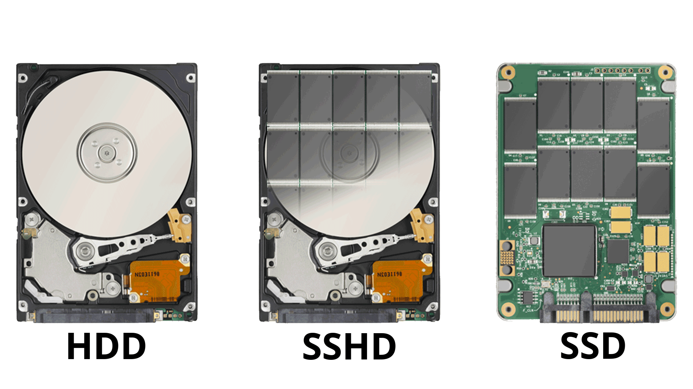
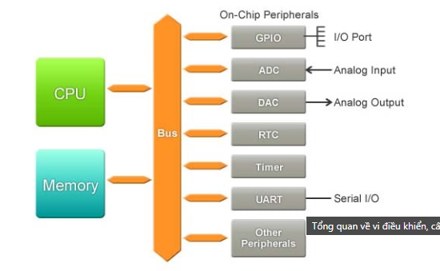
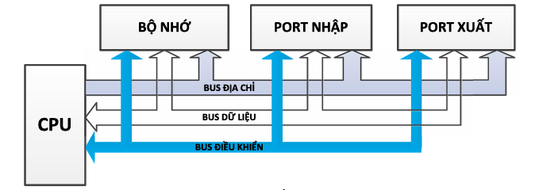

# Bộ môn vi xử lý
 

## I. TỔNG QUAN VỀ VI XỬ LÝ - VI ĐIỀU KHIỂN
### 1.1. Giới thiệu chung về vi xử lý - vi điều khiển

* Vi điều khiển (Microcontroller, MCU) là một mạch tích hợp (IC) bao gồm bộ vi xử lý trung tâm (CPU), bộ nhớ (RAM, ROM), và các cổng vào/ra (I/O), bộ chuyển đổi ADC/DAC, giao tiếp nối tiếp. Tất cả nằm trong một chip duy nhất, phục vụ cho việc điều khiển một hệ thống cụ thể

* Nói cách khác: MCU = CPU + Bộ nhớ + Ngoại vi -> gói gọn trong một vi mạch

- Lịch sử phát triển:
  -  Năm 1971, hai công ty ở Mỹ đã giới thiệu con vi xử lý (microprocessor), đó là Intel và Texas Instruments. Intel giới thiệu con VXL 4004.
  -  Năm1974: Texas Instruments phát triển TMS1000 – được xem là vi điều khiển đầu tiên.
  -  Thập niên 1980–1990: Các dòng 8051, PIC, AVR ra đời → phổ biến rộng rãi.
  -  Hiện nay: MCU có khả năng xử lý mạnh mẽ, hỗ trợ kết nối không dây (Wi-Fi, BLE), công nghệ ARM Cortex-M chiếm ưu thế

- Đặc điểm:
  - Tích hợp cao: nhiều chức năng trong một chip
  - Tiêu thụ điện năng thấp
  - Chi phí rẻ sơ với việc dùng vi xử lý +  ngoại vi rời
  - Chuyên dụng thiết kế cho các tác vụ cụ thể

* Vi điều khiển thường được sử dụng trong các hệ thống nhúng. Nó cũng được sử dụng trong các thiết bị điện, điện tử như máy giặt, lò vi sóng, điện thoại, đầu đọc DVD, thiết bị đa phương tiện hay dây chuyền sản xuất tự động ...
RAM

  

ROM

  

Các thiết bị ngoại vi

  

GPIO: Cổng vào/ra
ADC: Analog to Digital Convert
DAC: Digital to Analog Convert
RTC: Real Time Clock
Timer: Bộ định thời
UART: Cổng giao tiếp nối tiếp (USB)

8bit, 16bit, 32bit, 64bit

01010101, 0101 0101 0101 0101, 0101 0101 0101 0101 0101 0101 0101 0101, 0101 0101 0101 0101 0101 0101 0101 0101 0101 0101 0101 0101 0101 0101 0101 0101,

  

Bộ nhớ dùng để lưu chương trình cho vi xử lý thực hiện và lưu dữ liệu cần xử lý, các ngoại vi dùng để xuất nhập dữ liệu từ bên ngoài vào xử lý và điều khiển trở lại. Các khối này liên kết với nhau và tạo thành một hệ thống vi xử lý

Yêu cầu điều khiển càng cao thì hệ thống càng phức tạp và nếu yêu cầu điều khiển đơn giản thì hệ thống vi xử lý cũng phải có đầy đủ các khối trên

Để kết nối các khối trên tạo thành một hệ thống vi xử lý đòi hỏi người thiết kế phải rất hiểu biết về tất cả các thành phần vi xử lý, bộ nhớ, các thiết bị ngoại vi. Hệ thống tạo ra khá phức tạp, chiếm nhiều không gian, mạch in, và vấn đề chính là đòi hỏi người thiết kế phải hiểu thật rõ về hệ thống. Một lý do nữa là vi xử lý thường xử lý dữ liệu theo byte hoặc word trong khi các đối tượng điều khiển trong công nghiệp thường điều khiển theo bit
Chính vì sự phức tạp trên nên các nhà chế tạo đã tích hợp bộ nhớ và một số thiết bị ngoại vi cùng với vi xử lý tạo thành một IC gọi là vi điều khiển - Microcontroller
