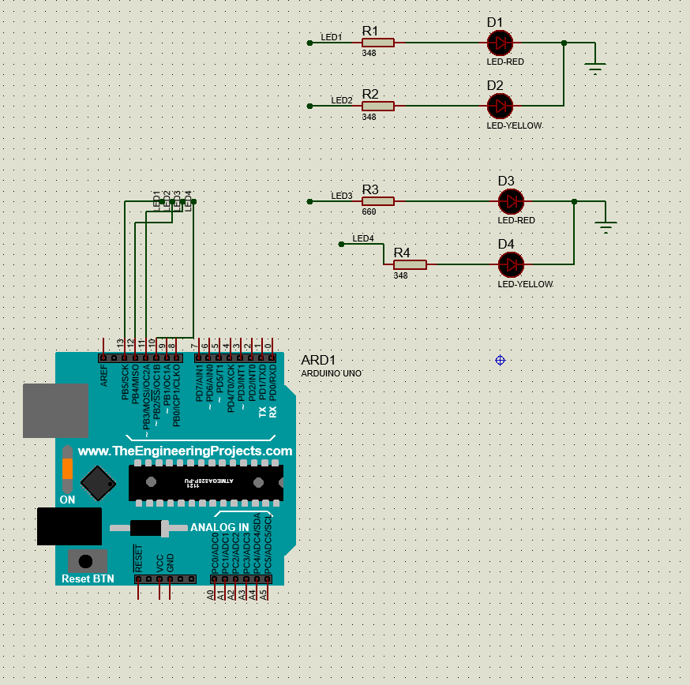

```C
#define LED1 13
#define LED2 12
#define LED3 11
#define LED4 10
void setup() {
  // put your setup code here, to run once:
  pinMode(LED1, OUTPUT);
  pinMode(LED2, OUTPUT);
  pinMode(LED3, OUTPUT);
  pinMode(LED4, OUTPUT);
}

void loop() {
  // put your main code here, to run repeatedly:
  digitalWrite(LED1, HIGH);
  digitalWrite(LED2, LOW);
  digitalWrite(LED3, LOW);
  digitalWrite(LED4, LOW);
  delay(500);
  digitalWrite(LED1, LOW);
  digitalWrite(LED2, HIGH);
  digitalWrite(LED3, LOW);
  digitalWrite(LED4, LOW);
  delay(500);
  digitalWrite(LED1, LOW);
  digitalWrite(LED2, LOW);
  digitalWrite(LED3, HIGH);
  digitalWrite(LED4, LOW);
  delay(500);
  digitalWrite(LED1, LOW);
  digitalWrite(LED2, LOW);
  digitalWrite(LED3, LOW);
  digitalWrite(LED4, HIGH);
  delay(500);
}
```

- **`#define LED1 13`**
  - Đây là dòng định nghĩa chân số 13 là LED1, có thể có hoặc không giúp chương trình rõ ràng hơn
- **`void setup() { }`**
  - Đây là hàm khởi tạo, có chức năng khởi tạo các chân của vi điều khiển, hàm này chạy khi vi điều khiển bắt đầu hoạt động
- **`void loop() { }`**
  - Vòng lặp vô tận, chương trình sẽ chạy mãi trong hàm này cho đến khi nhấn nút Reset hoặc ngừng cung cấp điện
- **`digitalWrite(LED1, LOW);`**
  - Đưa chân LED1(chân số 13 của board Arduino Uno) xuống mức thấp (0V)
- **`digitalWrite(LED1, HIGH);`**
  - Đưa chân LED1(chân số 13 của board Arduino Uno) lên mức cao (5V)
- **`delay(500)`**
  - Hàm delay có chức năng dừng chương trình trong vòng 500ms

