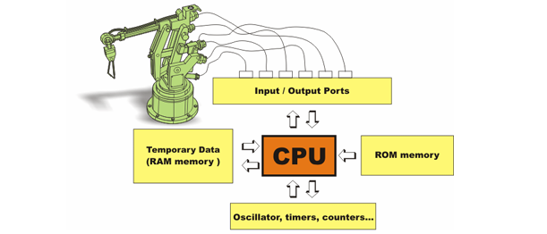
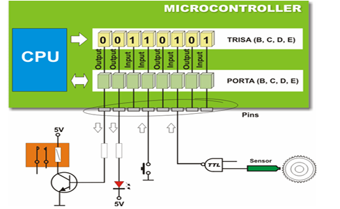
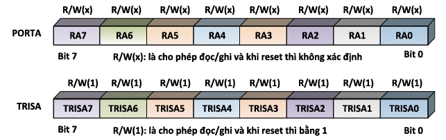

### I. GIỚI THIỆU
Ở bài này khảo sát các port xuất nhập của vi điều khiển PIC16F877A, các lệnh để định cấu hình cho port và các lệnh xuất nhập dữ liệu cho port ̣̣̣̣̣(1port = 8bit) (1GB = 1024MB, 1MB = 1024KB, 1B = 8bit)

### II. CHỨC NĂNG CỦA CÁC PORT CỦA VI ĐIỀU KHIỂN
Vi điều khiển có các port để xuất nhập dữ liêu giao tiếp với các đối tượng điều khiển. Tín hiệu điều khiển từ CPU gởi ra các port để điều khiển, đồng thời các port nhận dữ liệu về CPU để xử lý. Trong một hệ thống luôn có các tín hiệu vào/ ra
<p align="center">
  
</p>

Các port chỉ tạo ra các mức logic tương thích với chuẩn TTL, nếu điều khiển các đối tượng công suất lớn thì phải thêm mạch giao tiếp

### CÁC PORT CỦA PIC16F877A
Vi điều khiển PIC16F877A có 5 port A, B, C, D và E, khả năng cấp và nhận dòng 25mA
<p align="center">
  
</p>

Mỗi port của vi điều khiển PIC gồm có thanh ghi port và thanh ghi định hướng cho port
Hình trên trình bày PORTA và thanh ghi định hướng TRISA. Bit của thanh ghi định hướng TRIS bằng 0 thì port có chức năng xuất dữ liệu, nếu bằng 1 thì có chức năng nhập dữ liệu

Chú ý: '0' tương ứng với OUT, '1' tương ứng với IN

PORTA là port 2 chiều 8 bit, thanh ghi định hướng là TRISA có chức năng cấu hình vào/ra cho các bit xuất nhập của PortA
<p align="center">
  
</p>

#### Dùng vi điều khiển PIC16F877A điều khiển 1 led đơn sáng tắt
<p align="center">
  
</p>

```C
#include <16F877A.h> //Khai bao thu vien su dung 

#use delay(crystal=20000000) //Khai bao thach anh su dung 20Mhz

void main() //Chuong trinh chinh
{
   set_tris_d(0x00); //PORT D la OUTPUT
   while(TRUE)
   {
//!      output_high(PIN_D0); //xuat muc cao ra chan RD0 cua vi dieu khien
//!      delay_ms(1000);
//!      output_low(PIN_D0); //Xuat muc thap ra chan RD0 cua vi dieu khien
//!      delay_ms(1000);

      output_d(0b00000001); //RD7 RD6 RD5 RD4 RD3 RD2 RD1 RD0
      delay_ms(2000);
      output_d(0b00000000); //RD7 RD6 RD5 RD4 RD3 RD2 RD1 RD0
      delay_ms(2000);
   }
}

```
Giải thích chương trình
- **`#include <16F877A.h>`**
  - Khai báo thư viện đang sử dụng là PIC16F877A
- **`#use delay(crystal=20000000)`**
  - Khai báo tần số thạch anh mà vi điều khiển sử dụng, với khai báo trên thì tần số sử dụng là 20Mhz

- **`set_tris_d(0x00);`**
  - Có chức năng khởi tạo PORT D là PORT xuất dữ liệu
- **`output_high(PIN_D0)`**
  - Xuất tín hiệu mức cao ra chân RD0 ̣̣(chân số 0 của PORT D)

- **`output_low(PIN_D0)`**
  - Xuất tín hiệu mức thấp ra chân RD0 ̣̣(chân số 0 của PORT D)

- **`output_d(0b00000001);`**
  - Xuất tín hiệu chân số 0 PORTD ̣(chân đầu tiên bên phải PORTD) mức cao

- **`output_d(0b0000000);`**
  - Xuất tín hiệu chân số 0 PORTD ̣(chân đầu tiên bên phải PORTD) mức thấp

- **`delaỵ(1000)`** dừng chương trình 1000ms = 1s
