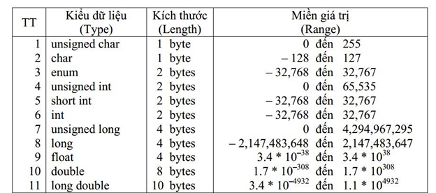

# II. VÒNG LẶP TRONG LẬP TRÌNH C
1. Kiểu dữ liệu
<p align="center">
  
</p>
2. Vòng lặp While

```C
#include <stdio.h> // thu vien chuan
void main(void){    //chuong trinh chinh
    printf("Hello, cao dang quang ngai");
    unsigned char x = 0;  // 0 -> 255
    while (x < 5)
    {
        printf("\nGia tri cua x: %d\n", x);
        x++ ; //tăng x thêm 1 đơn vị rồi gán ngược lại cho x
    }
}
```

3. Ứng dụng trong vi điều khiển
```C
#include <16F877A.h> //Khai bao thu vien su dung 
#use delay(crystal=20000000) //Khai bao thach anh su dung 20Mhz
void main() //Chuong trinh chinh
{
   set_tris_d(0x00); //PORT D la OUTPUT
   unsigned char x = 0;
   while(x<5), //Kiểm tra điều kiện nếu x < 5 thì vào vòng lặp, x lớn hơn hoặc bằng 5 thì thoát khỏi vòng lặp
   {
      output_high(PIN_D0); //xuat muc cao ra chan RD0 cua vi dieu khien
      output_high(PIN_D1);
      output_high(PIN_D2);
      output_high(PIN_D3);
      delay_ms(1000);
      output_low(PIN_D0); //Xuat muc thap ra chan RD0 cua vi dieu khien
      output_low(PIN_D1);
      output_low(PIN_D2);
      output_low(PIN_D3);
      delay_ms(1000);
      x = x + 1;

//!      output_d(0x0F); //RD7 RD6 RD5 RD4 RD3 RD2 RD1 RD0
//!      delay_ms(100);
//!      output_d(0x00); //RD7 RD6 RD5 RD4 RD3 RD2 RD1 RD0
//!      delay_ms(1000);
   }
}
```

3. Vòng lặp for

```C
#include <16F877A.h> //Khai bao thu vien su dung 
#use delay(crystal=20000000) //Khai bao thach anh su dung 20Mhz
void main() //Chuong trinh chinh
{
   set_tris_d(0x00); //PORT D la OUTPUT
   for(unsigned char x=0; x<5; x++>), //Kiểm tra điều kiện nếu x < 5 thì vào vòng lặp, x lớn hơn hoặc bằng 5 thì thoát khỏi vòng lặp
   {
      output_high(PIN_D0); //xuat muc cao ra chan RD0 cua vi dieu khien
      output_high(PIN_D1);
      output_high(PIN_D2);
      output_high(PIN_D3);
      delay_ms(1000);
      output_low(PIN_D0); //Xuat muc thap ra chan RD0 cua vi dieu khien
      output_low(PIN_D1);
      output_low(PIN_D2);
      output_low(PIN_D3);
      delay_ms(1000);
      x = x + 1;
   }
}
```

4. Vòng lặp do while

```C
#include <16F877A.h> //Khai bao thu vien su dung 
#use delay(crystal=20000000) //Khai bao thach anh su dung 20Mhz
void main() //Chuong trinh chinh
{
   set_tris_d(0x00); //PORT D la OUTPUT
   unsigned char x=5;
   do{
      output_high(PIN_D0); //Xuat ra muc cao (5V) o chan RD0
      output_high(PIN_D1); //Xuat ra muc cao (5V) o chan RD1
      output_high(PIN_D2);
      output_high(PIN_D3);
      output_high(PIN_D4);
      output_high(PIN_D5);
      output_high(PIN_D6);
      output_high(PIN_D7);
      delay_ms(1000); // Dung chuong trinh trong vong 1000ms = 1s
      output_low(PIN_D0); // Xuat ra muc thap (0V) o chan RD0
      output_low(PIN_D1); // Xuat ra muc thap (0V) o chan RD1
      output_low(PIN_D2);
      output_low(PIN_D3);
      output_low(PIN_D4);
      output_low(PIN_D5);
      output_low(PIN_D6);
      output_low(PIN_D7);
      delay_ms(1000);
      x++;
   }while (x<5);
}
```

Vòng lặp do while khác vòng lặp while ở chỗ sẽ thực hiện khối lệnh bên trong 'do' trước khi kiểm tra điều kiện trong while còn vòng lặp while thì kiểm tra điều kiện trước rồi mới vào bên trong thực hiện khối lệnh

- Đầu tiên khối câu lệnh bên trong vòng lặp **`do-while`** sẽ được chạy một lần rồi mới đến đánh giá biểu thức bên trong ngoặc đơn `()` của `while`
- Nếu biểu thức kiểm tra là **`true`**, các câu lệnh bên trong thân vòng lặp **`do-while`** được thực thi tiếp. Các câu lệnh thực thi bên trong thân vòng lặp cần phải cập nhật lại biểu thức kiểm tra điều kiện

- Sau đó biểu thức kiểm tra được đánh giá lại
- Quá trình diễn ra cho đến khi biểu thức kiểm tra được đánh giá là **`false`**.
- Nếu biểu thức kiểm tra là **`false`**, vòng lặp chấm dứt (kết thúc).
