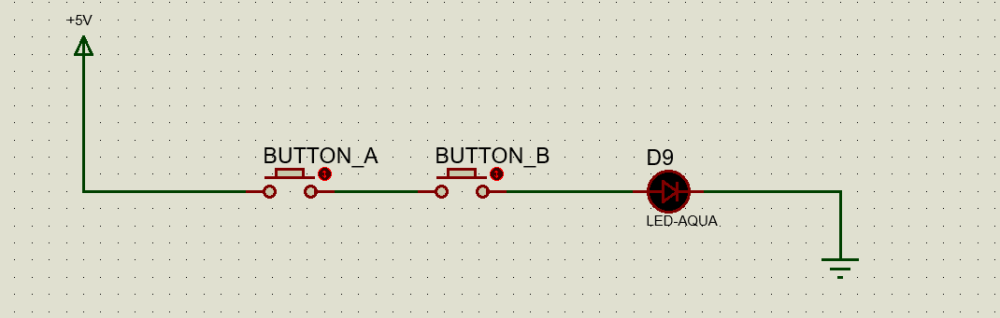
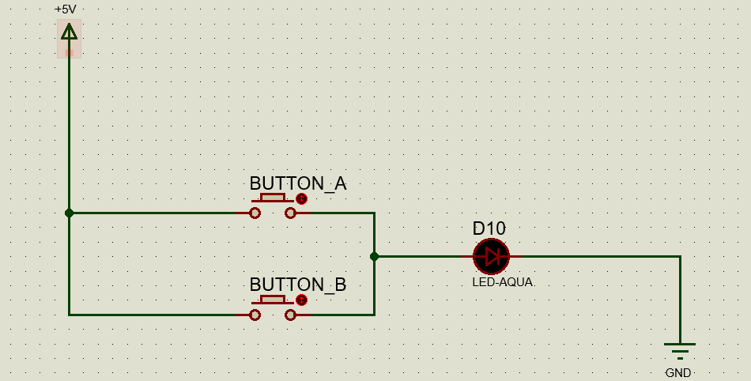

# 1.4. Toán tử thao tác bit trong lập trình vi xử lý
1.4.1. Toán tử Shift Left `<<`
 Toán tử Shift Left (<<) được sử dụng để dịch các bít của một số sang trái. Các bit ở phía bên trái sẽ bị loại bỏ và các bit 0 sẽ được điền vào các vị trí trống.

1.4.2. Toán tử Shift Right `>>`
Toán tử Shift Right (>>) được sử dụng để dịch các bit của một số sang phải. Các bit ở phía bên phải sẽ bị loại bỏ và các bit 0 sẽ được điền vào các vị trí trống.

1.4.3. Toán tử **`AND`** bit ( & )

|A | B| A AND B|
|---|---|---|
|0|0|0|
|0|1|0|
|1|0|0|
|1|1|1|

Toán tử AND bit ( & ) được sử dụng để thực hiện phép toán AND(và) trên từng bit của hai số nguyên. Các bit của số kết quả sẽ được đặt bằng 1 nếu cả hai bit tương ứng của hai số đều là 1
1.4.4. Toán tử **`OR`** bit ( | )

|A|B|A OR B|
|---|---|---|
|0|0|0|
|0|1|1|
|1|0|1|
|1|1|1|

Toán tử OR bit ( | ) được sử dụng để thực hiện phép toán OR(hoặc) trên từng bit của hai số nguyên. Các bit của số kết quả sẽ được đặt bằng 1 nếu một trong hai bit tương ứng của hai số là 1

1.4.5. Toán tử NOT bit ( ~ )
Toán tử NOT bit ( ~ ) được sử dụng để đảo ngược các bit của một số nguyên. Các bit của số kết quả sẽ được đảo ngược, tức là các bit có giá trị 0 sẽ trở thành 1 và các bit có giá trị 1 sẽ trở thành 0.

|A|NotA|
|---|---|
|0|1|
|1|0

```C
#include <16F877A.h> //Khai bao thu vien su dung 
#use delay(crystal=20000000) //Khai bao thach anh su dung 20Mhz

void main() //Chuong trinh chinh
{
   set_tris_d(0x00); //PORT D la OUTPUT
      while(TRUE){
         unsigned char out = 0x00;
         for(unsigned char i=0; i<8; i++){
            out = out | 0x01 << i;
            output_d(out);
            delay_ms(100);
         }
         for(unsigned char i=1; i<=8; i++){
            out = out & 0xFF>>i;
            output_d(out);
            delay_ms(100);
         }
      }

}

```
Đây là chương trình ví dụ sử dụng kết hợp các toán tử AND (&), OR(|), xoay trái (<<), xoay phải(>>) trên vi điều khiển PIC16F877A